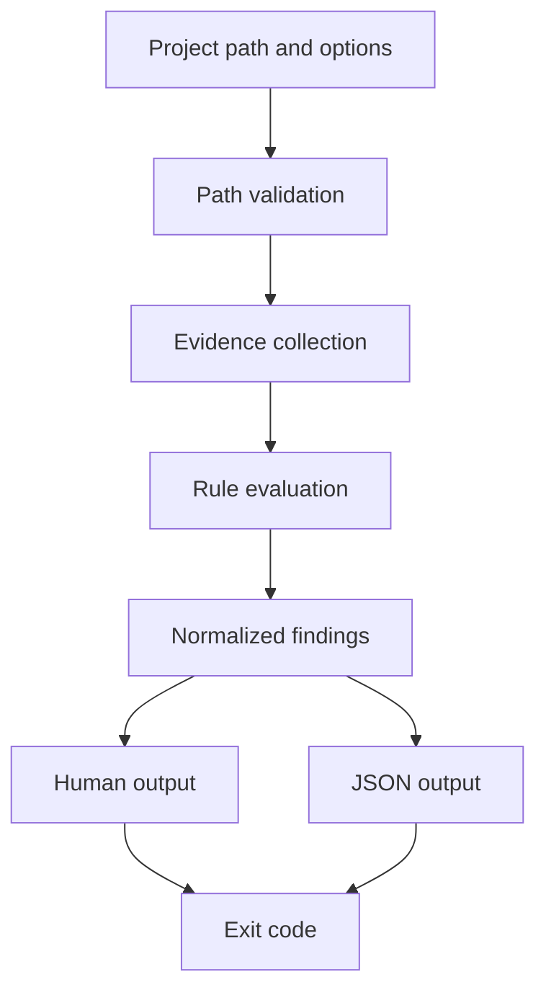
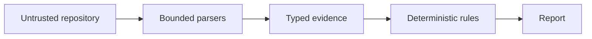

# Architecture

## Data flow



## Packages

| Path | Responsibility |
| --- | --- |
| `cmd/canopy-doctor/` | Process entry point and build version |
| `internal/cli/` | Argument parsing and command orchestration |
| `internal/project/` | Target validation and safe path handling |
| `internal/evidence/` | Static Canopy configuration and descriptor evidence |
| `internal/rules/` | Deterministic CNPY001 through CNPY004 evaluation |
| `internal/upstream/` | Bounded local Git comparison |
| `internal/diagnostic/` | Finding and decision types |
| `internal/report/` | Human and JSON serialization |
| `internal/releasecontract/` | Repository Action and release checks |
| `testdata/` | Passing, review, blocking, and malformed fixtures |

## Trust boundary



Canopy Doctor reads source, generated descriptor data, and local Git metadata.
It does not execute target code. Paths remain inside the target root, input sizes
are limited, Git hooks and external diff commands are disabled, and reports use
project-relative paths.

## Finding model

Each finding contains:

```text
rule_id
code
severity
decision
summary
details
evidence_locations
remediation
confidence
```

Collectors describe observed facts. Rules assign findings. Reporters sort and
serialize those findings. This separation keeps human and JSON decisions equal.

## Network behavior

The current checks are offline. Fork analysis uses only commits already present
in the inspected Git repository. A future network adapter must remain explicit
and replaceable.

## Scope

Behavioral replay is outside this executable. It would require a separate
runner, controlled state export, and state comparison design.
